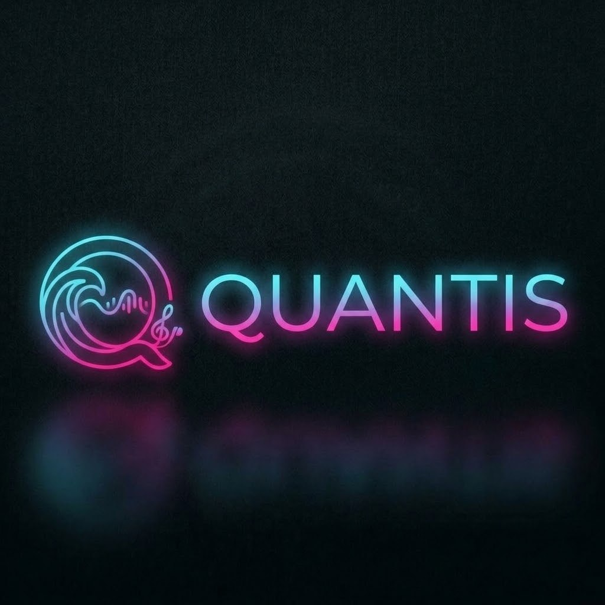

<p align="center">
  
</p>

<p align="center">
  <strong>Десктопный музыкальный плеер для RU/CIS</strong><br>
  Яндекс.Музыка · YouTube · Офлайн
</p>

<p align="center">
  <a href="https://www.python.org/"></a>
  <a href="LICENSE"></a>
  <a href="https://github.com/Really-Fun/Quantis/releases"></a>
  <a href="https://github.com/Really-Fun/Quantis/commits"></a>
  
  
</p>

<p align="center">
  <a href="https://github.com/Really-Fun/Quantis/releases/latest"></a>
  <a href="#поддержать-проект"></a>
</p>

<p align="center">
  <a href="#скриншоты">Скриншоты</a> ·
  <a href="#возможности">Возможности</a> ·
  <a href="#темы">Темы</a> ·
  <a href="#быстрый-старт">Быстрый старт</a> ·
  <a href="#разработка">Разработка</a> ·
  <a href="#поддержать-проект">Поддержать</a>
</p>

---

## О проекте

**Quantis** — десктопный кроссплатформенный плеер на **PySide6** и **asyncio**.
Одно окно для поиска, прослушивания и скачивания музыки с **Яндекс.Музыки**, **SoundCloud**,
**YouTube**: история, «Моя волна», радио по
треку и нативная интеграция с медиа-клавишами ОС.

Воспроизведение работает через **Qt Multimedia** или **VLC (libvlc)** — это две
отдельные сборки exe.

## Скриншоты

<table>
<tr>
<td width="50%"></td>
<td width="50%"></td>
</tr>
<tr>
<td align="center"><sub>Главная — «Для тебя», плейлисты и player bar</sub></td>
<td align="center"><sub>Поиск — Яндекс, YouTube и SoundCloud в одной выдаче</sub></td>
</tr>
<tr>
<td width="50%"></td>
<td width="50%"></td>
</tr>
<tr>
<td align="center"><sub>Плейлист — обложка, треки, источники YA/YT</sub></td>
<td align="center"><sub>Статистика — прослушивания на обоях</sub></td>
</tr>
</table>

## Возможности

| | |
|---|---|
| **Поиск** | Параллельно по Яндекс.Музыке и YouTube, debounce, прогрессивная выдача по источникам, ленивые списки без прогрузки всего каталога |
| **Воспроизведение** | Qt Multimedia или VLC, seek/громкость, автопереход к следующему треку |
| **Радио и волна** | «Моя волна» (Yandex rotor), радио по любому треку через YouTube Watch Playlist |
| **Библиотека** | Любимые треки, свои плейлисты, «Недавно прослушанные», «Скачанные» |
| **Офлайн** | Скачивание треков и обложек в `Музыка/Quantis`, статус загрузки на карточке |
| **История** | SQLite: недавно прослушанное и продолжение с сохранённой позиции |
| **Интерфейс** | MVVM, `EventBus`, QSS-темы, панель «Сейчас играет», обои |
| **Интеграция** | Медиа-клавиши ОС: SMTC (Windows) и MPRIS (Linux), keyring для токенов |
| **Расширяемость** | Плагины из `plugins_dir/` со своими страницами в UI |

## Темы

Переключаются в **Настройки → Тема**.

| Тема | Характер |
|------|----------|
| **Aurora** | Cyan + magenta, свечение, тема по умолчанию |
| **Glass** | Стекло поверх обоев, включает фон автоматически |
| **Редакционная** | Georgia + mono, cyan/red, акцент на панель «Сейчас» |
| **Классическая** | Спокойный тёмный steel-blue |
| **Светлая** | Приглушённый светлый режим |
| **Тёмно-жёлтая** | Тёплый amber-акцент |

## Быстрый старт

Нужны Python **3.13 или 3.14** и [Poetry](https://python-poetry.org/docs/#installation).

```bash
git clone https://github.com/Really-Fun/Quantis.git
cd Quantis
poetry install
poetry run quantis
```

Готовый установщик — на странице [Releases](https://github.com/Really-Fun/Quantis/releases/latest).

### Аккаунты

Без токенов работают поиск и воспроизведение **YouTube**. Всё остальное
подключается во вкладке **Member**:

- **Yandex Music** — OAuth-токен, хранится в keyring (там же виден статус Яндекс Плюс)
- **YouTube Music** — cookies в файле `credentials/youtube_cookies.txt` внутри [каталога данных](docs/build.md#каталоги-данных) (keyring на Windows не принимает большие blob'ы)

<details>
<summary>Прописать токен Яндекса вручную</summary>

```python
import keyring

keyring.set_password("YANDEX_TOKEN_NEON_APP", "NEON_APP", "<ваш_oauth_токен>")
```

</details>

## Сборка и архитектура

- **Сборка exe и установщик** (варианты `qt`/`vlc`, Inno Setup, каталоги данных) — [docs/build.md](docs/build.md)
- **Слои, поток воспроизведения, структура каталогов** — [docs/architecture.md](docs/architecture.md)
- **Карта интерфейса** (страницы, сигналы `EventBus`) — [docs/ui-map.md](docs/ui-map.md)

## Разработка

```bash
# тесты (сетевые помечены @pytest.mark.network)
poetry run pytest tests/ -q

# линтеры
poetry run ruff check src tests
poetry run black --check src tests
```

Отключить системный медиа-адаптер при отладке — `QUANTIS_ENABLE_ADAPTER=0`.
Подробнее о процессе и code style — в [.github/CONTRIBUTING.md](.github/CONTRIBUTING.md).

## Дорожная карта

- [ ] Android-клиент
- [ ] Spotify / VK / SoundCloud
- [ ] Горячие клавиши (Space, Ctrl+←/→)
- [ ] Визуализатор
- [ ] Пользовательские темы и фоны

## Поддержать проект

Quantis бесплатный и с открытым исходным кодом. Если он вам пригодился — можно
поддержать разработку через CloudTips: это идёт на серверы, тестовые устройства
и кофе.

<p align="center">
  <a href="https://pay.cloudtips.ru/p/c8c0b13b">
    
  </a>
</p>

<p align="center">
  
</p>

## Лицензия

[GNU GPL v3](LICENSE) · © [Really-Fun](https://github.com/Really-Fun)

<p align="center">
  <sub>Если Quantis полезен — поставьте звезду на GitHub. Это правда помогает.</sub>
</p>
