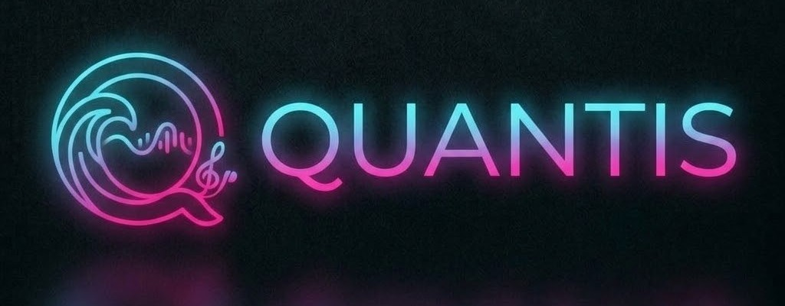
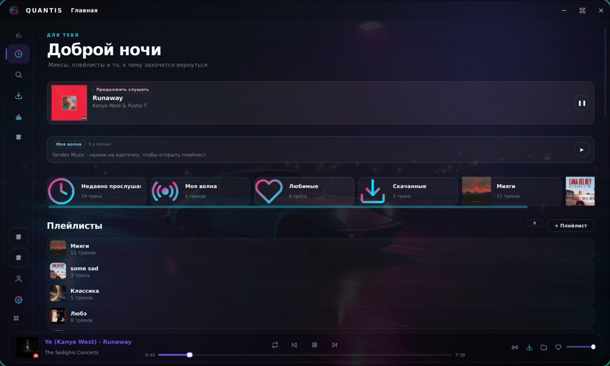
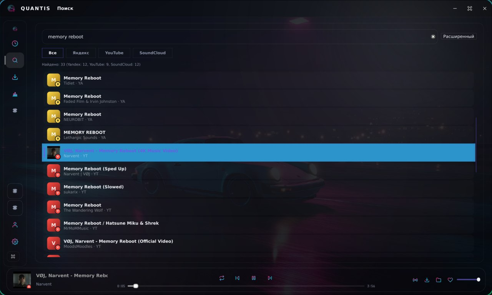
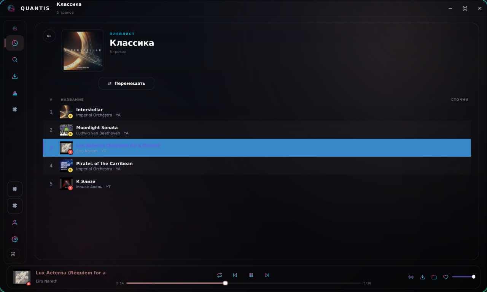
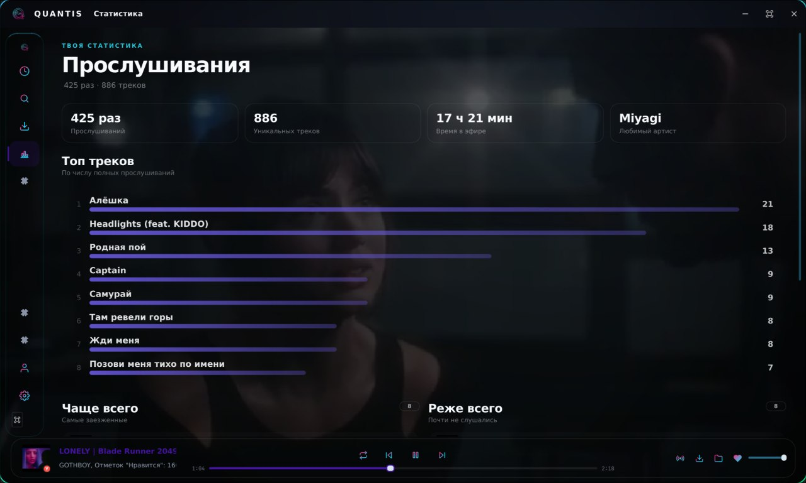

<p align="center">
  
</p>

<h3 align="center">Вся твоя музыка в одном окне</h3>

<p align="center">
  Десктопный плеер для Яндекс.Музыки, YouTube и SoundCloud:<br>
  один поиск, одна библиотека, офлайн и видео-обои, которые играют вместе с треком.
</p>

<p align="center">
  <a href="https://github.com/Really-Fun/Quantis/releases/latest"></a>
  <a href="https://github.com/Really-Fun/Quantis/actions/workflows/ci.yml"></a>
  <a href="https://www.python.org/"></a>
  
  
  <a href="LICENSE"></a>
</p>

<p align="center">
  <a href="https://github.com/Really-Fun/Quantis/releases/latest"></a>
  <a href="#поддержать-проект"></a>
</p>

<p align="center">
  <a href="#возможности">Возможности</a> ·
  <a href="#скриншоты">Скриншоты</a> ·
  <a href="#установка">Установка</a> ·
  <a href="#плагины">Плагины</a> ·
  <a href="#разработка">Разработка</a> ·
  <a href="#дорожная-карта">Дорожная карта</a>
</p>

<br>

<p align="center">
  
</p>

## Возможности

<table>
<tr>
<td width="50%" valign="top">

### 🔎 Один поиск на все сервисы
Яндекс.Музыка, YouTube и SoundCloud в общей выдаче. Результаты
появляются по мере ответа каждого источника, а ещё можно просто
вставить ссылку на трек.

</td>
<td width="50%" valign="top">

### 🌊 Моя волна и радио
«Моя волна» из Яндекс.Музыки и бесконечное радио от любого трека.
Когда не знаешь, что включить.

</td>
</tr>
<tr>
<td valign="top">

### 🎬 Живые обои
Клип текущего трека играет фоном и держится в такт со звуком,
даже на часовых миксах. Можно поставить и свои картинки.

</td>
<td valign="top">

### 📥 Офлайн
Скачивай треки с обложками в `Музыка/Quantis` и слушай без интернета:
всё скачанное собрано в библиотеке.

</td>
</tr>
<tr>
<td valign="top">

### 🎨 Шесть тем
Aurora, Glass, Классическая, Редакционная, Светлая и Тёмно-жёлтая.
Акцентный цвет подстраивается под обложку.

</td>
<td valign="top">

### 📊 Статистика
Сколько часов ты слушаешь, любимый исполнитель, самые заслушанные
и почти забытые треки.

</td>
</tr>
<tr>
<td valign="top">

### ⌨️ Клавиатура и медиа-клавиши
Горячие клавиши на всё основное, медиа-клавиши и системный оверлей
через SMTC (Windows) и MPRIS (Linux).

</td>
<td valign="top">

### 🧩 Плагины
Расширения со своими страницами в интерфейсе ставятся из `.zip`
или по ссылке прямо в приложении.

</td>
</tr>
</table>

А ещё: полноэкранный режим «Сейчас играет», любимые и свои плейлисты,
экономный режим, пока окно в фоне (например, во время игры),
и уведомление о новой версии.

## Скриншоты

<table>
<tr>
<td width="33%"></td>
<td width="33%"></td>
<td width="33%"></td>
</tr>
<tr>
<td align="center"><sub><b>Поиск</b>: три сервиса в одной выдаче</sub></td>
<td align="center"><sub><b>Плейлист</b>: треки из разных источников</sub></td>
<td align="center"><sub><b>Статистика</b> на теме Glass</sub></td>
</tr>
</table>

<details>
<summary><b>Все темы</b></summary>

<br>

Переключаются в **Настройки → Тема**.

| Тема | Характер |
|------|----------|
| **Aurora** | Cyan + magenta со свечением, тема по умолчанию |
| **Glass** | Стекло поверх обоев, фон включается автоматически |
| **Редакционная** | Georgia + моноширинный шрифт, акцент на панели «Сейчас играет» |
| **Классическая** | Спокойный тёмный steel-blue |
| **Светлая** | Приглушённый светлый режим |
| **Тёмно-жёлтая** | Тёплый янтарный акцент |

</details>

## Установка

### Готовая сборка (Windows)

Скачай установщик со страницы [**Releases**](https://github.com/Really-Fun/Quantis/releases/latest).
Как собрать самому, в том числе вариант на libVLC, описано в [docs/build.md](docs/build.md).

### Из исходников (Windows, Linux)

Нужны Python **3.13 или 3.14** и [Poetry](https://python-poetry.org/docs/#installation).

```bash
git clone https://github.com/Really-Fun/Quantis.git
cd Quantis
poetry install
poetry run quantis
```

### Аккаунты

YouTube работает сразу, без входа. Остальное подключается во вкладке **Member**:

- **Яндекс.Музыка**: OAuth-токен. Хранится в системном keyring, там же виден статус Плюса.
- **YouTube Music**: cookies в файле `credentials/youtube_cookies.txt` в [каталоге данных](docs/build.md#каталоги-данных).

<details>
<summary>Прописать токен Яндекса вручную</summary>

```python
import keyring

keyring.set_password("YANDEX_TOKEN_NEON_APP", "NEON_APP", "<ваш_oauth_токен>")
```

</details>

<details>
<summary><b>Горячие клавиши</b></summary>

<br>

| Клавиша | Действие |
|---------|----------|
| <kbd>Пробел</kbd> | Play / Pause |
| <kbd>←</kbd> / <kbd>→</kbd> | Предыдущий / следующий трек |
| <kbd>↑</kbd> / <kbd>↓</kbd> | Громче / тише |
| <kbd>L</kbd> | В любимые / убрать |
| <kbd>R</kbd> | Режим повтора |
| <kbd>S</kbd> | Скрыть страницы, оставить шапку и плеер |
| <kbd>Alt</kbd>+<kbd>1</kbd>…<kbd>5</kbd> | Главная, Поиск, Библиотека, Статистика, Плагины |
| <kbd>Alt</kbd>+<kbd>M</kbd> | Member |
| <kbd>Alt</kbd>+<kbd>S</kbd> | Настройки |

</details>

## Плагины

Плагин — это `.zip` с `manifest.json` и `plugin.py`. Устанавливается на странице
**Плагины**: из файла или по HTTPS-ссылке. Плагин подписывается на события плеера
и может добавить в интерфейс свою страницу.

```python
from quantis.models.track import Track
from quantis.plugins.base import BasePlugin


class HelloPlugin(BasePlugin):
    name = "Hello Plugin"

    async def on_load(self) -> None:
        self.subscribe("track_changed", self._on_track_changed)

    def _on_track_changed(self, track: Track) -> None:
        print(f"▶ {track.author} — {track.title}")
```

Какие события есть и как устроен интерфейс, описано в [docs/ui-map.md](docs/ui-map.md).

## Разработка

```bash
poetry install --with dev

poetry run pytest tests/ -q          # тесты; сетевые помечены @pytest.mark.network
poetry run ruff check src tests      # линтер
poetry run black --check src tests   # форматирование
poetry run mypy                      # типы
```

Те же проверки гоняет CI на каждый pull request. При отладке системный
медиа-адаптер можно отключить: `QUANTIS_ENABLE_ADAPTER=0`.

| Документ | О чём |
|----------|-------|
| [docs/architecture.md](docs/architecture.md) | Слои, поток воспроизведения, структура каталогов |
| [docs/ui-map.md](docs/ui-map.md) | Страницы интерфейса и сигналы `EventBus` |
| [docs/build.md](docs/build.md) | Сборка exe и установщика, каталоги данных |
| [CONTRIBUTING](.github/CONTRIBUTING.md) | Как предложить изменения и code style |

## Дорожная карта

- [x] Яндекс.Музыка, YouTube, SoundCloud
- [x] Горячие клавиши и медиа-клавиши ОС
- [x] Темы и свои обои
- [x] Видео-обои синхронно с треком
- [x] Плагины со своими страницами
- [ ] Каталог плагинов: визуализатор, диктор между треками
- [ ] Своя локальная музыка (папки, FLAC)
- [ ] Spotify, VK
- [ ] Android-клиент

## Поддержать проект

Quantis бесплатный и с открытым кодом. Если он тебе пригодился, можно поддержать
разработку через CloudTips: деньги идут на серверы, тестовые устройства и кофе.

<p align="center">
  <a href="https://pay.cloudtips.ru/p/c8c0b13b"></a>
  <br>
  <a href="https://pay.cloudtips.ru/p/c8c0b13b"></a>
</p>

## Лицензия

[GNU GPL v3](LICENSE) · © [Really-Fun](https://github.com/Really-Fun)

<p align="center">
  <sub>Нравится Quantis? Поставь ⭐, это правда помогает проекту.</sub>
</p>
