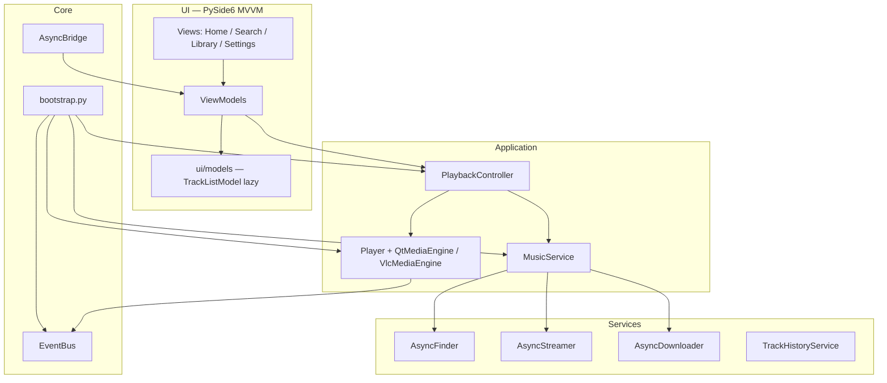

# Архитектура Quantis

Слои разделены: виджеты не ходят в сеть напрямую, бизнес-логика живёт в
`services/` и `controllers/`, а `core/bootstrap.py` работает composition root —
собирает зависимости и передаёт их через конструкторы, без God Object.



**Поток воспроизведения:** View → ViewModel → `PlaybackController` →
`MusicService` / `Player` → `EventBus` → UI.

## Структура проекта

```text
src/quantis/
├── adapter/          # MPRIS (Linux), SMTC (Windows)
├── assets/           # иконки, встроенные обои
├── config/           # клиенты API, credentials, keyring
├── controllers/      # PlaybackController (медиатор)
├── core/             # bootstrap, AsyncBridge, PluginHost
├── database/         # SQLite, история прослушивания
├── models/           # Track, Playlist — чистые доменные модели
├── player/           # Player, QtMediaEngine, VlcMediaEngine
├── plugins/          # EventBus, базовый класс плагинов
├── providers/        # пути, плейлисты, TrackManager
├── services/         # поиск, стриминг, скачивание, волна, лайки
├── styles/           # QSS-темы (neon, glass, editorial, …)
├── types/            # общие типы
├── utils/            # вспомогательные функции, resource_path
└── ui/
    ├── models/       # UI-модели (lazy TrackListModel)
    ├── viewmodels/   # Home, Search, Player VM
    └── views/        # страницы, player bar, виджеты
```

В корне репозитория, помимо `src/`:

```text
.github/              # шаблоны Issues/PR, CoC, CONTRIBUTING, SECURITY, FUNDING
docs/                 # архитектура, сборка, карта UI
docs/assets/          # логотип и скриншоты для README
packaging/
├── inno/             # Inno Setup (quantis.iss)
├── pyinstaller/      # main.spec, VERSIONINFO, runtime hooks
└── scripts/          # build_exe.py, build_installer.py, bootloader
tests/                # pytest, маркер @pytest.mark.network для сетевых тестов
```

Карта интерфейса — страницы, оболочка окна и сигналы `EventBus` —
в [ui-map.md](ui-map.md).
